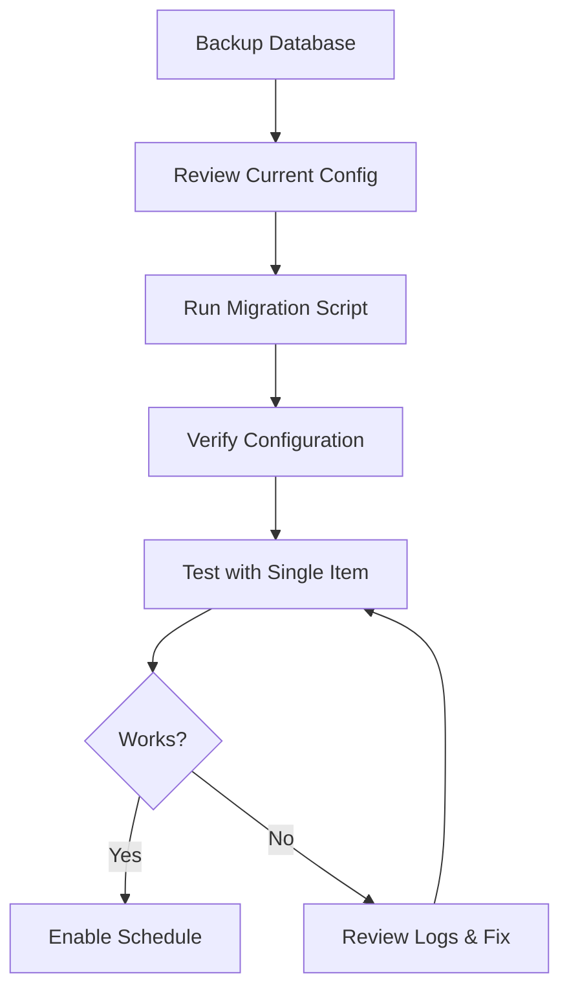

# Filter and Chain Migration Summary

## Overview

This document provides a comprehensive summary of the database migrations that consolidate multiple APIs into unified configurations with filter-based routing to different printers.

## Migrations Included

### 1. API 2 & 4 Consolidation
**File:** `consolidate-apis-with-chained-filters.sql`

**Before:**
- **API 2**: Fetch all → Filter OrderId starts with "SS" or "SO" → Print to Printer 1
- **API 4**: Fetch all → Filter OrderId NOT "SS" or "SO" → Print to Printer 2
- **Problem**: Two API calls for same data

**After:**
- **API 2 Unified**: Single fetch → Two branches:
  - Branch 1: Filter "SS"/"SO" → Navigate → Print to Printer 1
  - Branch 2: Filter NOT "SS"/"SO" → Navigate → Print to Printer 2
- **Benefit**: Single API call, parallel processing

**Actions Created:**
- Action 1: Navigate - SS/SO Orders
- Action 2: Print SS/SO Orders - Printer 1
- Action 3: Navigate - Non SS/SO Orders
- Action 4: Print Non SS/SO Orders - Printer 2

### 2. API 3 Multi-Branch
**File:** `consolidate-api3-with-chained-filters.sql`

**Before:**
- **API 3**: Single branch for all personalized orders
- Filter: IsFilePath only
- All orders → Same printer

**After:**
- **API 3 Unified**: Single fetch → Two branches with combined filters:
  - Branch 1: IsFilePath + OrderId "SS"/"SO" → Navigate → Save → Print to Printer 1
  - Branch 2: IsFilePath + OrderId NOT "SS"/"SO" → Navigate → Save → Print to Printer 2
- **Benefit**: Order type routing while maintaining file path validation

**Actions Created:**
- Action 1: Navigate - SS/SO Custom Forms
- Action 2: Save PDF - SS/SO Orders
- Action 3: Print PDF - SS/SO Orders (Printer 1)
- Action 4: Navigate - Non-SS/SO Custom Forms
- Action 5: Save PDF - Non-SS/SO Orders
- Action 6: Print PDF - Non-SS/SO Orders (Printer 2)

## Migration Workflow



### Step-by-Step Process

#### 1. Backup Database
```bash
# Create timestamped backup
copy "data\api_config.db" "data\api_config.db.backup-$(Get-Date -Format 'yyyyMMdd-HHmmss')"
```

#### 2. Review Current Configuration
```sql
-- Check API 2 current state
SELECT p.ApiNumber, p.ApiName, s.ActionNumber, s.ActionName
FROM PrimaryApi p
LEFT JOIN SubAction s ON p.Id = s.PrimaryApiId
WHERE p.ApiNumber IN (2, 4);

-- Check API 3 current state
SELECT p.ApiNumber, p.ApiName, s.ActionNumber, s.ActionName
FROM PrimaryApi p
LEFT JOIN SubAction s ON p.Id = s.PrimaryApiId
WHERE p.ApiNumber = 3;
```

#### 3. Run Migration Scripts

**Option A: Run Both Migrations**
```bash
# Run API 2/4 migration
sqlite3 "data\api_config.db" < "scripts\consolidate-apis-with-chained-filters.sql"

# Run API 3 migration
sqlite3 "data\api_config.db" < "scripts\consolidate-api3-with-chained-filters.sql"
```

**Option B: Run One at a Time** (Recommended)
```bash
# Test API 2/4 first
sqlite3 "data\api_config.db" < "scripts\consolidate-apis-with-chained-filters.sql"
# Verify and test...

# Then API 3
sqlite3 "data\api_config.db" < "scripts\consolidate-api3-with-chained-filters.sql"
# Verify and test...
```

#### 4. Verify Configuration

**API 2 Verification:**
```sql
-- Should see 4 actions
SELECT ActionNumber, ActionName, ActionType
FROM SubAction
WHERE PrimaryApiId = (SELECT Id FROM PrimaryApi WHERE ApiNumber = 2)
ORDER BY ExecutionOrder;

-- API 4 should be deleted
SELECT COUNT(*) as Should_Be_Zero FROM PrimaryApi WHERE ApiNumber = 4;
```

**API 3 Verification:**
```sql
-- Should see 6 actions
SELECT ActionNumber, ActionName, ActionType
FROM SubAction
WHERE PrimaryApiId = (SELECT Id FROM PrimaryApi WHERE ApiNumber = 3)
ORDER BY ExecutionOrder;
```

#### 5. Test Configuration

Test manually before enabling schedules:
```bash
# Test API 2 (picklists)
# Run service manually and check logs

# Test API 3 (personalized orders)
# Run service manually and check logs
```

#### 6. Update Printer Names (If Needed)

**API 2 Printers:**
```sql
-- Update Printer 1 (SS/SO orders)
UPDATE SubAction
SET Configuration = json_set(Configuration, '$.PrinterName', 'YourPrinter1')
WHERE PrimaryApiId = (SELECT Id FROM PrimaryApi WHERE ApiNumber = 2)
  AND ActionNumber = 2;

-- Update Printer 2 (Other orders)
UPDATE SubAction
SET Configuration = json_set(Configuration, '$.PrinterName', 'YourPrinter2')
WHERE PrimaryApiId = (SELECT Id FROM PrimaryApi WHERE ApiNumber = 2)
  AND ActionNumber = 4;
```

**API 3 Printers:**
```sql
-- Update Printer 1 (SS/SO personalized)
UPDATE SubAction
SET Configuration = json_set(Configuration, '$.PrinterName', 'YourPrinter1')
WHERE PrimaryApiId = (SELECT Id FROM PrimaryApi WHERE ApiNumber = 3)
  AND ActionNumber = 3;

-- Update Printer 2 (Other personalized)
UPDATE SubAction
SET Configuration = json_set(Configuration, '$.PrinterName', 'YourPrinter2')
WHERE PrimaryApiId = (SELECT Id FROM PrimaryApi WHERE ApiNumber = 3)
  AND ActionNumber = 6;
```

## Filter Types Reference

### API 2 & 4 Filters

| Filter Type | Field | Description | Example |
|-------------|-------|-------------|---------|
| StartsWithAny | Array index 17 (OrderId) | Matches if starts with ANY value | `["SS", "SO"]` |
| NotStartsWithAny | Array index 17 (OrderId) | Matches if does NOT start with ANY value | `["SS", "SO"]` |

### API 3 Filters

| Filter Type | Field | Description | Example |
|-------------|-------|-------------|---------|
| IsFilePath | itemNotes | Primary filter: Must be file path (not JSON) | `.html` extension required |
| StartsWithAny | orderId | Additional filter: Matches if starts with ANY value | `["SS", "SO"]` |
| NotStartsWithAny | orderId | Additional filter: Inverse match | `["SS", "SO"]` |

## Architecture Comparison

### API 2 Architecture

```
BEFORE (2 APIs):
┌─────────────────────────────────────┐
│ API 2: Fetch All Picklist Items    │
│   Filter: StartsWith "SS" or "SO"  │
│   Navigate → Print (Printer 1)     │
└─────────────────────────────────────┘
┌─────────────────────────────────────┐
│ API 4: Fetch All Picklist Items    │ ← Duplicate Fetch!
│   Filter: NOT "SS" or "SO"          │
│   Navigate → Print (Printer 2)     │
└─────────────────────────────────────┘

AFTER (1 API):
┌─────────────────────────────────────────────────┐
│ API 2 Unified: Fetch All Picklist Items ONCE   │
├─────────────────────────────────────────────────┤
│ Branch 1                 │ Branch 2             │
│ Filter: SS/SO           │ Filter: NOT SS/SO    │
│ Navigate                │ Navigate             │
│ Print (Printer 1)       │ Print (Printer 2)    │
└─────────────────────────────────────────────────┘
```

### API 3 Architecture

```
BEFORE (1 Branch):
┌────────────────────────────────────┐
│ API 3: Fetch Personalized Orders  │
│   Filter: IsFilePath               │
│   Navigate → Save → Print (P1)    │
└────────────────────────────────────┘

AFTER (2 Branches):
┌─────────────────────────────────────────────────────────┐
│ API 3 Unified: Fetch Personalized Orders ONCE          │
├─────────────────────────────────────────────────────────┤
│ Branch 1                    │ Branch 2                  │
│ Filter: IsFilePath + SS/SO │ Filter: IsFilePath + NOT  │
│ Navigate                    │ Navigate                  │
│ Save PDF                    │ Save PDF                  │
│ Print (Printer 1)          │ Print (Printer 2)         │
└─────────────────────────────────────────────────────────┘
```

## Documentation Files

| File | Purpose |
|------|---------|
| `FILTER-AND-CHAIN-ARCHITECTURE.md` | Detailed API 2 architecture and examples |
| `API3-FILTER-ARCHITECTURE.md` | Detailed API 3 architecture and examples |
| `QUICK-REFERENCE.md` | Quick commands for API 2 operations |
| `QUICK-REFERENCE-API3.md` | Quick commands for API 3 operations |
| `MIGRATION-SUMMARY.md` | This file - overall migration guide |

## Common Post-Migration Tasks

### Add More Filter Prefixes

**API 2 - Add "SR" and "SX" to Branch 1:**
```sql
UPDATE SubAction
SET Configuration = json_set(
    Configuration,
    '$.ChainedFilterValues',
    json('["SS", "SO", "SR", "SX"]')
)
WHERE PrimaryApiId = (SELECT Id FROM PrimaryApi WHERE ApiNumber = 2)
  AND ActionNumber IN (1, 3);  -- Update both navigate actions
```

**API 3 - Add "SR" and "SX" to Branch 1:**
```sql
UPDATE SubAction
SET Configuration = json_set(
    Configuration,
    '$.AdditionalFilterValues',
    json('["SS", "SO", "SR", "SX"]')
)
WHERE PrimaryApiId = (SELECT Id FROM PrimaryApi WHERE ApiNumber = 3)
  AND ActionNumber IN (1, 4);  -- Update both navigate actions
```

### Add Third Branch (Example: RUSH Orders)

See `QUICK-REFERENCE.md` and `QUICK-REFERENCE-API3.md` for complete examples of adding additional branches.

**Quick Template:**
```sql
-- Navigate action (filter)
INSERT INTO SubAction (...) VALUES (...filter config...);

-- For API 2: Print action (chained from navigate)
INSERT INTO SubAction (...) VALUES (...print config...);

-- For API 3: Save action (chained from navigate)
INSERT INTO SubAction (...) VALUES (...save config...);

-- For API 3: Print action (chained from save)
INSERT INTO SubAction (...) VALUES (...print config...);
```

### Change File Prefixes (API 3 Only)

```sql
-- Update both Save and Print actions in same branch
UPDATE SubAction
SET Configuration = json_set(Configuration, '$.OutputFilePrefix', 'new-prefix')
WHERE PrimaryApiId = (SELECT Id FROM PrimaryApi WHERE ApiNumber = 3)
  AND ActionNumber IN (2, 3);  -- Branch 1: Save and Print
```

## Rollback Procedures

### Restore from Backup

```bash
# Stop service first
net stop ScheduledPrintService

# Restore backup
copy "data\api_config.db.backup-YYYYMMDD-HHMMSS" "data\api_config.db"

# Restart service
net start ScheduledPrintService
```

### Partial Rollback (Disable New Actions)

If you want to keep new structure but temporarily disable:

```sql
-- Disable all API 2 sub-actions
UPDATE SubAction
SET IsEnabled = 0
WHERE PrimaryApiId = (SELECT Id FROM PrimaryApi WHERE ApiNumber = 2);

-- Disable all API 3 sub-actions
UPDATE SubAction
SET IsEnabled = 0
WHERE PrimaryApiId = (SELECT Id FROM PrimaryApi WHERE ApiNumber = 3);
```

## Monitoring and Validation

### Check Filter Effectiveness

After running for a while, check logs to see how items are distributed:

```
Expected Log Patterns:

API 2:
- "Filtered X items for Action 1" (SS/SO count)
- "Filtered Y items for Action 3" (Non-SS/SO count)
- X + Y should equal total items in API response

API 3:
- "Filtered X items for Action 1" (SS/SO with IsFilePath)
- "Filtered Y items for Action 4" (Non-SS/SO with IsFilePath)
- Some items may be filtered out by IsFilePath check
```

### Verify Printer Assignments

```sql
-- Show all printer assignments
SELECT
    p.ApiNumber,
    p.ApiName,
    s.ActionNumber,
    s.ActionName,
    json_extract(s.Configuration, '$.PrinterName') as PrinterName
FROM PrimaryApi p
JOIN SubAction s ON p.Id = s.PrimaryApiId
WHERE p.ApiNumber IN (2, 3)
  AND (s.ActionType = 'PrintCapturedHtml' OR s.ActionType = 'PrintSavedPdf')
ORDER BY p.ApiNumber, s.ActionNumber;
```

### Check for Configuration Errors

```sql
-- Find actions with missing critical fields
SELECT
    p.ApiNumber,
    s.ActionNumber,
    s.ActionName,
    s.ActionType,
    CASE
        WHEN s.ActionType IN ('PrintCapturedHtml', 'PrintSavedPdf')
             AND json_extract(s.Configuration, '$.PrinterName') IS NULL
        THEN 'Missing PrinterName'
        WHEN s.ActionType = 'NavigateOnly'
             AND json_extract(s.Configuration, '$.Endpoint') IS NULL
        THEN 'Missing Endpoint'
        WHEN json_extract(s.Configuration, '$.ChainedFromActionNumber') IS NOT NULL
             AND NOT EXISTS (
                 SELECT 1 FROM SubAction s2
                 WHERE s2.PrimaryApiId = s.PrimaryApiId
                   AND s2.ActionNumber = json_extract(s.Configuration, '$.ChainedFromActionNumber')
             )
        THEN 'Broken Chain'
        ELSE 'OK'
    END as Status
FROM PrimaryApi p
JOIN SubAction s ON p.Id = s.PrimaryApiId
WHERE p.ApiNumber IN (2, 3)
  AND Status != 'OK';

-- Should return no rows
```

## Performance Considerations

### Before Migration
- **API 2 + API 4**: Two separate API calls, sequential processing
- **API 3**: Single API call, single printer

### After Migration
- **API 2**: Single API call, parallel branch processing
- **API 3**: Single API call, parallel branch processing
- **Expected Improvement**: ~50% reduction in API calls, faster overall execution

### Optimization Tips

1. **Reduce Wait Times**: If pages load quickly, reduce `WaitForNetworkIdleMs`
2. **Disable Unused Branches**: If you don't process certain order types, disable those actions
3. **Monitor Queue Depth**: Check if printer queue depth affects performance
4. **Batch Similar Items**: Items going to same printer are already batched by filter

## Troubleshooting

### Items Not Routing Correctly

**Check Filter Configuration:**
```sql
SELECT
    ActionNumber,
    ActionName,
    json_extract(Configuration, '$.ChainedFilterType') as FilterType,
    json_extract(Configuration, '$.ChainedFilterValues') as FilterValues
FROM SubAction
WHERE PrimaryApiId = (SELECT Id FROM PrimaryApi WHERE ApiNumber = 2)
  AND ActionType = 'NavigateOnly';
```

**Check Actual Data:** Review API response logs to see what values are in index 17 (OrderId)

### Items Not Printing

**Check Printer Names:**
```sql
SELECT
    ActionNumber,
    ActionName,
    json_extract(Configuration, '$.PrinterName') as PrinterName
FROM SubAction
WHERE PrimaryApiId = (SELECT Id FROM PrimaryApi WHERE ApiNumber = 2)
  AND ActionType = 'PrintCapturedHtml';
```

**Verify Printer Names Match Exactly:**
- Check Windows printer names: `Get-Printer | Select-Object Name`
- Update if needed using UPDATE queries above

### PDFs Not Saving (API 3)

**Check File Prefixes:**
```sql
SELECT
    ActionNumber,
    ActionName,
    ActionType,
    json_extract(Configuration, '$.OutputFilePrefix') as FilePrefix
FROM SubAction
WHERE PrimaryApiId = (SELECT Id FROM PrimaryApi WHERE ApiNumber = 3)
  AND ActionType IN ('SaveCapturedHtml', 'PrintSavedPdf');
```

**Ensure Matching Prefixes:** Save and Print actions in same branch must have same prefix

## Support and Resources

### Log Locations
- Service Logs: `C:\ProgramData\ScheduledPrintService\logs\`
- PDF Outputs: `C:\ProgramData\ScheduledPrintService\pdfs\` (or configured location)

### Database Location
- Production: `C:\Program Files\ScheduledPrintService\api_config.db`
- Development: `data\api_config.db`

### Useful Commands

**View Database Schema:**
```bash
sqlite3 "data\api_config.db" ".schema"
```

**Export Current Config:**
```bash
sqlite3 "data\api_config.db" ".dump" > config-export.sql
```

**Check Database Integrity:**
```bash
sqlite3 "data\api_config.db" "PRAGMA integrity_check;"
```

## Next Steps

1. ✅ Run migrations
2. ✅ Verify configuration
3. ✅ Update printer names
4. ✅ Test with single item
5. ✅ Monitor logs
6. ✅ Enable schedules
7. ✅ Monitor production

## Questions or Issues?

Refer to:
- `FILTER-AND-CHAIN-ARCHITECTURE.md` - Detailed API 2 documentation
- `API3-FILTER-ARCHITECTURE.md` - Detailed API 3 documentation
- `QUICK-REFERENCE.md` - API 2 quick commands
- `QUICK-REFERENCE-API3.md` - API 3 quick commands
